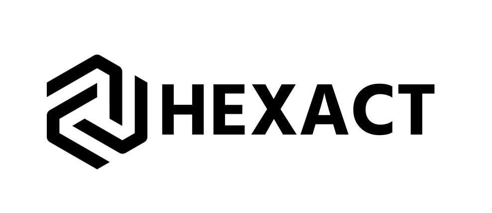

# 🛠️ HexAct — Система автоматической детекции и классификации болтов и гаек

**HexAct** — это веб-приложение на базе **OpenCV.js**, предназначенное для автоматического контроля качества крепёжных изделий в реальном времени с использованием веб-камеры. Система способна различать **болты и гайки**, определять их **тип головки** (шестигранник, Phillips и др.) и выявлять **брак** или **несоответствия** по форме.

> 💡 **Название**:  
> - **Hex** — от *hexagon* (шестигранник), основной стандарт формы головок крепежа.  
> - **Act** — действие, подчёркивающее оперативность и автоматизацию процесса контроля.

---

## 🎯 Цель проекта

Обеспечить **доступный, быстрый и объективный** способ контроля качества болтов и гаек без использования дорогостоящего оборудования. HexAct может использоваться как на производстве, так и в складских или ремонтных условиях для предотвращения использования некачественного или несоответствующего крепежа.

---

## 🧠 Основные возможности

- 📸 **Работа в реальном времени** через веб-камеру.
- 🔍 **Автоматическое распознавание**:
  - Болты: шестигранные (`hex`), крестообразные (`Phillips`).
  - Гайки: только шестигранные (`hex`) — всё остальное считается браком.
- ⚠️ **Классификация по качеству**:
  - ✅ **Правильные** — соответствуют ожидаемому типу.
  - ⚠️ **Предупреждения** — неизвестная форма, но не явный брак.
  - ❌ **Брак** — пяти-/семи-/восьмиугольники, незавершённые шестиугольники, круги без креста и др.
- 📊 **Статистика в реальном времени**:
  - Общее количество деталей.
  - Процент корректных, бракованных и сомнительных изделий.
- 📈 **Графики и история**:
  - Линейный график точности по последним 10 сессиям.
  - Возможность сохранения, просмотра и экспорта логов.
- 📥 **Экспорт данных**:
  - В формате CSV.
  - Печать отчёта с визуализацией статистики.
- 🌙 **Тёмная/светлая тема** с сохранением в `localStorage`.
- 🖥️ **Полноэкранный режим** для удобства работы.

---

## 🧪 Поддерживаемые типы крепежа

| Тип       | Подтип                  | Статус        | Примечание |
|-----------|-------------------------|---------------|------------|
| Болт      | Шестигранник (`hex`)    | ✅ Корректный | Стандарт   |
| Болт      | Phillips (`phillips`)   | ✅ Корректный | Стандарт   |
| Болт      | Пяти-/семи-/восьмиугольник | ❌ Брак     | Не по ГОСТ |
| Болт      | Незавершённый шестиугольник | ❌ Брак   | Дефект     |
| Болт      | Круг без креста         | ❌ Брак       | Не болт    |
| Гайка     | Шестигранник (`hex`)    | ✅ Корректный | Стандарт   |
| Гайка     | Любой другой тип        | ❌ Брак       | Не гайка   |

> ❗ **Важно**: При переключении вкладки ("Болты" / "Гайки") система ожидает именно соответствующий тип изделия.

---

## 🛠️ Технологии

- **Frontend**: HTML5, CSS3, JavaScript (ES6+)
- **Компьютерное зрение**: [OpenCV.js](https://docs.opencv.org/4.x/d5/d10/tutorial_js_root.html)
- **Алгоритмы**:
  - Контурный анализ (`findContours`, `approxPolyDP`)
  - Распознавание окружностей (`HoughCircles`)
  - Детекция линий (`HoughLinesP`) для крестообразных головок
  - Фоновое вычитание (`absdiff`) для улучшения детекции
- **Хранение данных**: `localStorage` (логи сессий)
- **Адаптивный дизайн**: поддержка светлой/тёмной темы, печати, полноэкранного режима

---

## ▶️ Как запустить

1. **Склонируйте репозиторий**:
   ```bash
   git clone https://github.com/StepanKislin/hexact.git
   cd hexact
   ```

2. **Откройте `index.html` в браузере**:
   - Рекомендуется использовать **Chrome** или **Edge** (лучшая поддержка `getUserMedia` и `OpenCV.js`).
   - Для локального запуска лучше использовать **локальный сервер** (например, `Live Server` в VS Code), чтобы избежать CORS-ограничений.

3. **Разрешите доступ к камере** при первом запуске.

4. **Настройте параметры** (по желанию):
   - Порог уверенности (50–95%)
   - Мин./макс. размер объекта (в пикселях)
   - Запомните фон для улучшения контраста

5. **Начните детекцию**:
   - Положите болт или гайку в поле зрения камеры.
   - Переключайте вкладки в зависимости от типа изделия.

---

## 📁 Структура проекта

```
hexact/
├── index.html                 # Основная HTML-страница
├── package.json               # Метаданные и зависимости проекта  (даже если их нет)
├── package-lock.json          # Фиксация версий зависимостей (автогенерируется)
├── assets/
│   ├── script/
│   │   └── index.js           # Логика приложения (OpenCV.js + детекция)
│   └── style/
│       └── index.css          # Стили интерфейса
├── LICENSE.md                 # Лицензия проекта
└── README.md                  # Документация проекта
```

---

## 📈 Применение

- **Производство**: контроль качества на конвейере.
- **Склад**: верификация партий крепежа при приёмке.
- **Ремонтные мастерские**: быстрая проверка перед использованием.
- **Образование**: демонстрация возможностей компьютерного зрения в браузере.

---

## 🔒 Безопасность и конфиденциальность

- Все данные обрабатываются **локально** в браузере.
- Изображения **не отправляются** на сервер.
- Логи хранятся только в `localStorage` устройства пользователя и могут быть удалены в любой момент.

---

> 🔧 **HexAct — точность в каждом винте.**  
> *Потому что даже маленький болт может удержать целую конструкцию.*